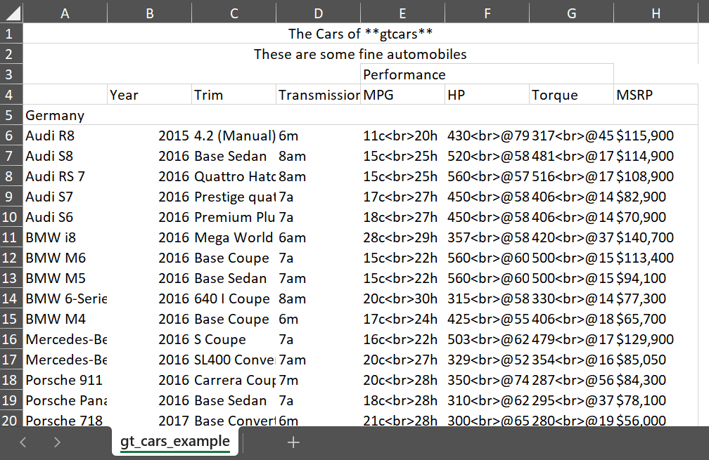

<!-- README.md is generated from README.Rmd. Please edit that file -->

# gtopenxlsx

<!-- badges: start -->

[](https://github.com/yannsay/gtopenxlsx/actions/workflows/R-CMD-check.yaml)
[](https://app.codecov.io/gh/yannsay/gtopenxlsx?branch=main)

<!-- badges: end -->

The goal of gtopenxlsx is to export gt tables to xlsx format.

## Installation

You can install the development version of gtopenxlsx like so:

``` r
devtools::install_github("yannsay-gtopenxlsx")
```

## Example

Example from the GT documentation

``` r
library(gtopenxlsx)
library(gt)
#> Warning: package 'gt' was built under R version 4.4.1
library(dplyr)
order_countries <- c("Germany", "Italy", "United States", "Japan")

tab <-
  gtcars |>
  arrange(
    factor(ctry_origin, levels = order_countries),
    mfr, desc(msrp)
  ) |>
  mutate(car = paste(mfr, model)) |>
  select(-mfr, -model) |>
  group_by(ctry_origin) |>
  gt(rowname_col = "car") |>
  cols_hide(columns = c(drivetrain, bdy_style)) |>
  cols_move(
    columns = c(trsmn, mpg_c, mpg_h),
    after = trim
  ) |>
  tab_spanner(
    label = "Performance",
    columns = c(mpg_c, mpg_h, hp, hp_rpm, trq, trq_rpm)
  ) |>
  cols_merge(
    columns = c(mpg_c, mpg_h),
    pattern = "<<{1}c<br>{2}h>>"
  ) |>
  cols_merge(
    columns = c(hp, hp_rpm),
    pattern = "{1}<br>@{2}rpm"
  ) |>
  cols_merge(
    columns = c(trq, trq_rpm),
    pattern = "{1}<br>@{2}rpm"
  ) |>
  cols_label(
    mpg_c = "MPG",
    hp = "HP",
    trq = "Torque",
    year = "Year",
    trim = "Trim",
    trsmn = "Transmission",
    msrp = "MSRP"
  ) |>
  fmt_currency(columns = msrp, decimals = 0) |>
  tab_header(
    title = md("The Cars of **gtcars**"),
    subtitle = "These are some fine automobiles"
  ) |>
  tab_source_note(
    source_note = md(
      "Source: Various pages within the Edmonds website."
    )
  )
```

``` r
library(openxlsx)
wb <- createWorkbook()
addWorksheet(wb, "gt_cars_example", gridLines = F)
tab |>
  gt_to_xlsx(wb, "gt_cars_example")
saveWorkbook(wb, "gt_cars_example.xlsx")
```



## Very beta version

Please put in issues reproducible example of tables failing so that I
can try as much as possible.

If you want to use `gtopenxlsx` as a base for your own rendering, you
can follow this
[article](https://yannsay.github.io/gtopenxlsx/articles/gt_to_xlsx_walkthrough.html)
that looks into `gt_to_xlxs.`

I only developed following the example in this
[vignette](https://gt.rstudio.com/articles/case-study-gtcars.html). Yet
there are many things still not working such as:

- not all types of formatting are working
- summary
- formatting: currently formatting reproduces the current format, does
  not change to excel formatting (i.e. change cells to dates or
  currencies)
- merge check other type of merge “merge_range”, “merge_uncert”,
  “merge_n_pct”, currently only “merge”
- [alignment and
  styles](https://gt.rstudio.com/articles/case-study-gtcars.html#column-alignment-and-style-changes)
- [text_transform](https://gt.rstudio.com/articles/case-study-gtcars.html#text-transforms)
- footnotes

Also likely to become gtopenxlsx2 when migrating to openxlsx2.

## THANKS

Thanks to the amazing work of posit, gt and openxlsx developpers!
